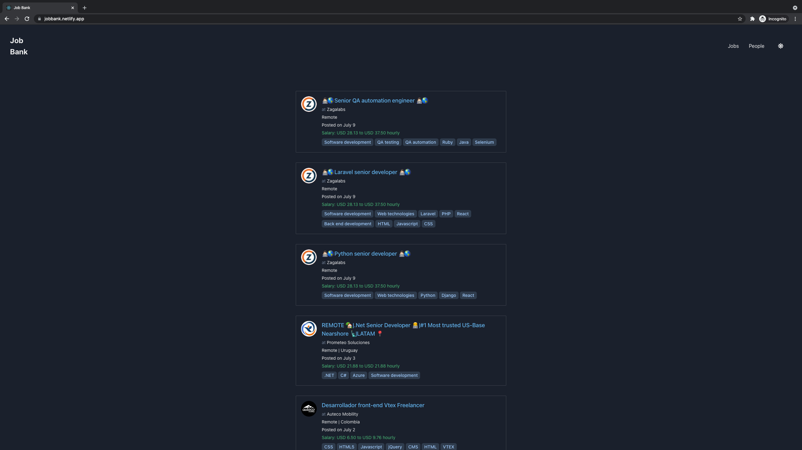

# Job Bank

> A Job Bank Web App where users can browse jobs and people in the market.

## Screenshot

## Built With

- React, Redux
- Chakra UI
- CRA, npm, yarn

## Live Demo

[Live Demo Link](https://jobbank.netlify.app/)

## Rails Backend

[Github Link](https://github.com/mohammadumar28/job-bank-backend)

## Getting Started

To get a local copy up and running follow these simple example steps.

## Prerequisites

- Yarn
- Node JS

## To run the Project

- Run `https://github.com/mohammadumar28/job-bank.git` to clone the project
- Go to the cloned directory
- Run `yarn install` to install node modules
- Run `yarn start` to start the app

## Authors

👤 **Muhammad Umar**

- GitHub: [@mohammadumar28](https://github.com/mohammadumar28)
- Twitter: [@Mohammadumar28](https://twitter.com/cmdumar)
- LinkedIn: [LinkedIn](https://www.linkedin.com/in/cmdumar/)

## 🤝 Contributing

Contributions, issues, and feature requests are welcome!

## Show your support

Give a ⭐️ if you like this project!

## Acknowledgments

- [Torre](https://torre.co/)
